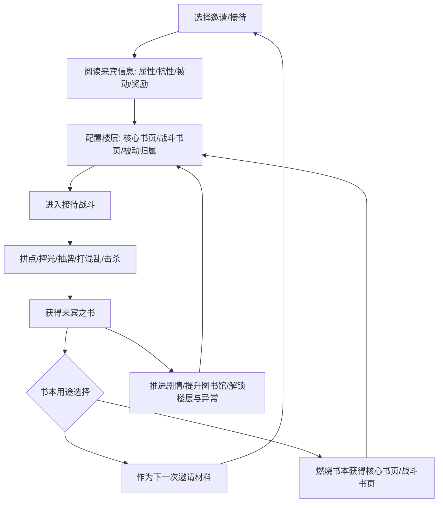
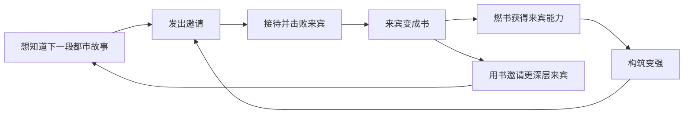

# 《废墟图书馆》系统策划拆解案

> 分析对象：Library Of Ruina / 废墟图书馆  
> 目标读者：游戏系统策划  
> 检索与成文日期：2026-05-23  
> 说明：本文基于官方页面、Steam/SteamDB、Steam 公告、Fandom Wiki、媒体评测、Reddit 社区样本与官方视频信息整理。我没有声称自己实机通关；涉及体验判断时，会标注来源类型或“策划推测”。

## 1. 基础信息

| 项目 | 内容 |
|---|---|
| 游戏名称 | Library Of Ruina / 废墟图书馆 |
| 开发商 | ProjectMoon |
| 发行商 | PC/Steam：ProjectMoon；PS4/Switch：Arc System Works / Arc System Works America |
| Steam 正式发售 | 2021-08-10；Steam 页面同时标注 Early Access Release Date 为 2020-05-15 |
| 主机版 | PS4 / Nintendo Switch 版官方站标注 2024-04-25 发售；Xbox/Windows 版 2021-08-10 上线，Xbox 新闻曾作为 Game Pass 上线信息发布 |
| 平台 | PC/Steam、Windows/Xbox、PlayStation 4、Nintendo Switch。PS5/Switch 2 兼容表现不作为官方原生平台结论 |
| 类型标签 | Steam 用户标签集中在 Story Rich、Card Game、Difficult、Strategy、Deckbuilding、Turn-Based Combat、Singleplayer、Psychological Horror 等 |
| 商业模式 | 买断制单机；Steam 另售 Soundtrack 与 ArtBook DLC；主机版官方资料称内含日语全语音、数字原声、数字画集、开发者评论 |
| 当前版本 / 更新 | Steam 官方公告列表可见最新补丁为 `Patch Note ver 1.1.0.6a12`，日期 2021-11-18。是否存在未在该列表展示的后续 PC 小补丁，公开资料不足以确认 |
| 主要受众 | 硬核单机策略玩家、卡牌构筑玩家、Project Moon 世界观玩家、叙事向黑暗幻想玩家 |
| 市场定位 | 非肉鸽的叙事型卡牌战斗 RPG；用“接待-成书-邀请”的主题包装构筑、关卡、成长和剧情推进 |
| 一句话概括 | 《废墟图书馆》把“击败敌人后敌人成为资源”做成了核心闭环：玩家通过接待客人获得书，书既是下一关门票，也是角色和卡组成长材料。 |

## 2. 资料来源与可信度说明

### 资料可信度表

| 信息类型 | 来源 | 可信度 | 用途 | 风险 |
|---|---|---|---|---|
| 官方机制说明 | Steam/SteamDB、Arc System Works 官方站、Steam 官方公告 | 高 | 确认基础事实、产品定位、平台、官方描述、更新记录 | 文案有营销包装，部分机制描述不够细 |
| 数值 / 道具 / 技能 | Library of Ruina Fandom Wiki；wiki.gg 仅作为检索参考，页面读取受限 | 中 | 战斗、书页、书本、情感等级、异常书页、被动归属等系统拆解 | 社区维护，可能版本过期；wiki.gg 未能完整读取 |
| 玩家体验 | Steam 评测区、Reddit `r/libraryofruina` | 中 | 验证新手门槛、难度尖峰、刷书、主机移植体验等痛点 | 主观、样本偏差明显；Reddit 不能当客观事实 |
| 视频实机 | Arc 官方站列出的 Gameplay Footage / Promotional Trailer、媒体嵌入页 | 中高 | 验证开场叙事、接待流程、战斗演示、主机版宣传点 | 我未直接抓取 YouTube 页面元数据；视频发布日期以官方站新闻日期为准 |
| 媒体评测 | Game Informer、Nintendo Life、TouchArcade、Final Weapon 等 | 中 | 辅助判断定位、上手门槛、主机 UI/性能争议 | 评测观点有作者偏好，不等同系统事实 |

### 实际使用来源

| 来源 | 链接 | 用途 | 可信度 | 是否可能过期 |
|---|---|---|---|---|
| Steam / SteamDB | https://store.steampowered.com/app/1256670/Library_Of_Ruina/；https://steamdb.info/app/1256670/info/ | 发售日、标签、价格、DLC、评价趋势、官方玩法描述、Workshop/成就/云存档等元信息 | 高 | 评价数、价格、折扣会变化；SteamDB 非 Valve 官方但基于 Steam 数据 |
| Steam 官方公告 | https://steamcommunity.com/app/1256670/announcements/?l=english | 补丁、Workshop、Custom Reception 工具、更新频率 | 高 | 公告列表可能不覆盖所有平台补丁 |
| Arc System Works 官方站 | https://www.arcsystemworks.jp/lor/en/ | 主机版发售日、平台、语言、产品信息 | 高 | 基本事实稳定 |
| Arc 官方 System 页 | https://www.arcsystemworks.jp/lor/en/system.php | 官方系统描述：接待、异常、书与书页 | 高 | 机制描述偏概括 |
| Arc System Works America 新闻 | https://www.arcsystemworks.com/library-of-ruina-coming-to-nintendo-switch-and-playstation-4-on-april-25-2024/ | PS4/Switch 发售、宣传片、日语语音等 | 高 | 基本事实稳定 |
| Xbox 新闻 | https://news.xbox.com/en-us/2021/08/10/library-of-ruina-is-now-available-for-windows-10-xbox-one-and-xbox-series-xs-xbox-game-pass/amp/ | Xbox/Windows 上线信息 | 高 | Game Pass 状态可能变化 |
| Fandom Wiki：Combat Pages | https://library-of-ruina.fandom.com/wiki/Combat_Pages | 战斗书页、9 张牌组、稀有度、复制限制、骰子类型 | 中 | 社区维护 |
| Fandom Wiki：Key Pages | https://library-of-ruina.fandom.com/wiki/Key_Pages | 核心书页、属性、抗性、被动归属、稀有度上限 | 中 | 社区维护 |
| Fandom Wiki：Books | https://library-of-ruina.fandom.com/wiki/Books | 书的获取、消耗、燃烧掉落、奖励池、失败消耗 | 中 | 社区维护 |
| Fandom Wiki：Invitations | https://library-of-ruina.fandom.com/wiki/Invitations | 红色邀请、一般邀请、故事树、关卡入口 | 中 | 社区维护 |
| Fandom Wiki：Stats | https://library-of-ruina.fandom.com/wiki/Stats | 情感硬币、光芒恢复、异常书页、等级阈值、速度骰、抗性 | 中 | 页面标注 Work in Progress，需谨慎 |
| Fandom Wiki：Abnormality Pages / Floor Realization | https://library-of-ruina.fandom.com/wiki/Abnormality_Pages；https://library-of-ruina.fandom.com/wiki/Floor_Realization | 异常书页、觉醒/崩溃页、楼层实现 | 中 | 社区维护，含剧透 |
| Game Informer | https://gameinformer.com/2021/08/17/library-of-ruina-might-be-the-best-game-you-sleep-on-this-year-dont | 媒体体验：系统复杂、Boss 谜题化、上手慢 | 中 | 2021 版本视角 |
| Nintendo Life Switch 评测 | https://www.nintendolife.com/reviews/switch-eshop/library-of-ruina | 主机移植 UI、文本、菜单与性能体验 | 中 | 2024 版本视角，可能被补丁改善 |
| TouchArcade Switch 更新/评测 | https://toucharcade.com/2024/05/24/library-of-ruina-switch-update-review-patch-cocoon-physical-release-preorder-eshop/ | Switch 版价值与性能 caveat | 中 | 补丁后状态可能变化 |
| Reddit 难度讨论样本 | https://www.reddit.com/r/libraryofruina/comments/1kqrovu | 玩家对难度、教程、机制阅读压力的反馈 | 中 | 主观且样本偏核心社区 |
| Reddit 首个难度尖峰样本 | https://www.reddit.com/r/libraryofruina/comments/1cduqg6 | 不同玩家在哪些战斗卡住 | 中 | 主观 |
| Reddit Switch 版样本 | https://www.reddit.com/r/libraryofruina/comments/1t8oia4/is_library_of_ruina_on_the_nintendo_worth_it/ | 2026 玩家对 Switch 版 UI、bug、文本的分歧反馈 | 中 | 单帖样本，版本/硬件差异 |
| 官方视频信息 | Arc 官方站新闻：Gameplay Footage I（2024-02-08）、Gameplay Footage II（2024-02-16）、Promotional Trailer（2024-04-11） | 验证官方以“来访”和“接待”切分演示重点 | 中高 | 我未直接抓取 YouTube 页面，标题和日期以官方站为准 |

## 3. 产品定位分析

《废墟图书馆》容易被外部玩家按“卡牌构筑”理解，但它和《Slay the Spire》一类肉鸽卡牌的核心差异很大。它没有日常任务、赛季、抽卡，也不是随机爬塔；它更接近“以固定关卡和章节推进的卡牌战斗 RPG”。玩家不是在一次 run 中临时构筑，而是在长期账号式存档中不断积累书页、核心书页、楼层能力和异常书页，然后针对每个接待重新配队。

差异化卖点主要有三层：

1. **主题和系统高度统一**：敌人死亡变成书，书能解锁新敌人，也能燃烧成装备和卡牌。成长资源、剧情线索、关卡钥匙是同一种叙事物件。
2. **战斗不是单纯出牌，而是“读敌人动作后对位拆解”**：玩家可以在出牌前查看敌方将使用的书页，围绕速度骰、目标线、拼点、单方面攻击、光芒和手牌规划做决策。
3. **楼层让同一套牌池产生不同战斗风格**：不同楼层有各自异常书页池，情感等级上升时可选择临场强化。这样，战前构筑和战中 roguelite 式选择被缝在一起。

核心玩家画像更偏“愿意阅读大量文本和被动描述、愿意失败后调整构筑”的玩家。Steam 标签中的 Difficult、Strategy、Deckbuilding 与 Story Rich 同时靠前，说明它的第一吸引力不是轻量爽局，而是世界观、音乐、美术、硬核系统学习和战斗解题。

长期留存点不是运营内容，而是：

- 主线章节对“下一本书”的悬念；
- 新接待带来的新书页和新构筑方向；
- 异常战、楼层实现、后期 Boss 的解题压力；
- Steam Workshop 的自定义接待和 Mod 生态。

## 4. 核心体验拆解

### 体验支柱 1：构筑前置的策略战斗

玩家的关键爽点不是“我抽到一张强牌”，而是“我读懂这个接待需要什么，然后把楼层、核心书页、被动、战斗书页拼成能解决它的队伍”。官方 Steam 文案强调玩家可查看客人的行动并选择最优卡牌对抗，骰子结果还会被效果和变量影响。这说明游戏希望玩家把随机性当作可管理风险，而不是纯运气。

支撑系统：

- 核心书页：决定角色基础数值、伤害/混乱抗性、被动能力。
- 战斗书页：构成 9 张牌组，决定每个速度骰可用动作。
- 被动归属：到 Urban Plague 后可把其他核心书页的被动转移到装备角色上，形成中后期深构筑。
- 楼层异常书页：战斗中根据情感等级选择，改变本场战斗策略。

### 体验支柱 2：高压拼点与可视化风险

每幕战斗前，敌我速度骰和出牌线会把冲突关系暴露出来。玩家需要判断哪些拼点必须赢，哪些攻击可以吃，哪些目标可以单方面输出，哪些角色需要保留光芒到下一幕。因为一次拼点的结果会影响 HP、混乱抗性、情感硬币、击杀节奏，玩家对每一个骰子的权重感会很强。

这个系统的好处是让卡牌战斗有“舞台对打”的观感：不是抽象数值相减，而是角色按书页顺序冲突、闪避、格挡、受击。代价是信息量很高，新玩家如果没读懂速度、目标转移、骰子类型和抗性，很容易觉得“我好像什么都没做错但输了”。

### 体验支柱 3：书本经济驱动内容推进

官方 System 页明确写到：击败客人会使其变成书，书可引导下一次邀请，也可用于抽取书页获得新能力。也就是说，游戏把“关卡奖励”和“下一关钥匙”合并为同一种资源。这个设计很锋利：玩家每次燃烧书本，都在成长和进度之间做取舍。

它带来的体验是强主题感和明确目标；风险是失败时消耗邀请书、缺特定掉落时重复刷接待，会让部分玩家认为流程“磨”。

### 体验支柱 4：叙事和战斗互相抬高

《废墟图书馆》的敌人不是随机怪包，而是带故事的“来宾”。核心书页还包含其原主人的故事。玩家获得敌人的书页，实际上是在把敌人的身份、战斗方式和都市记录收进图书馆。因为每个新敌人既是剧情角色，也是未来构筑材料，所以剧情推进会自然转化成系统期待。

### 体验支柱 5：困难、试错和掌握感

Reddit 多个帖子把难度尖峰称为“vertical difficulty spike”；Game Informer 也提到开局数小时上手较慢。系统策划角度看，这不是单纯数值高，而是游戏会突然考察某个前面可忽略的机制，比如抗性、楼层选择、异常页、集中火力、续航、群体攻击或特定 Boss 规则。喜欢它的玩家会把这看成“考试”；流失玩家会把它看成“教学没教就考”。

## 5. 核心循环拆解

### 总循环

### 单局循环：一幕到一幕

1. 查看敌方本幕书页、速度骰和目标线。
2. 给我方速度骰分配战斗书页，决定拼点、拦截或单方面攻击。
3. 战斗结算，骰子依次拼点，造成 HP / 混乱伤害或防御收益。
4. 获得正/负情感硬币，可能提升情感等级。
5. 情感升级时恢复光芒、提高最大光芒，并触发异常书页选择。
6. 敌我进入下一幕，手牌、光芒、混乱状态与死亡情况继续滚动。

这个循环的关键不是“每回合打最痛的牌”，而是分配有限光芒，让高成本书页、抽牌、回光、拼点胜率和击杀窗口互相配合。

### 日常循环

游戏没有官方日常/周常任务。所谓“日常循环”来自玩家自然会话：

- 打一个新接待；
- 失败后回去烧书、配卡、换楼层；
- 过关后读剧情；
- 再进入下一条故事树。

这让它没有运营压力，但也缺少外部留存机制。长期消耗完全依赖主线、挑战、收集和 Mod。

### 周期循环

周期不是按现实时间，而是按章节和楼层阶段：

- 章节推进带来新敌人和新书页；
- 图书馆等级/楼层进展带来异常战；
- 异常战解锁异常书页，改变该楼层构筑价值；
- 楼层实现和后期 Boss 把此前积累的系统全部拉进考试。

### 新手阶段循环

新手期主要让玩家理解：邀请、核心书页、战斗书页、光芒、拼点、书本燃烧。早期敌人相对简单，但问题在于 UI 里同时出现很多概念。玩家可以靠直觉打过前几战，却未必真正理解“为什么赢”。这为后续难度尖峰埋雷。

### 中后期循环

中后期的循环变成“为关卡定制解决方案”：

- 读敌人被动和抗性；
- 选择针对楼层；
- 用被动归属补强核心书页；
- 调整 9 张牌组里的回光、抽牌、输出、防御和状态组件；
- 在战斗中通过情感等级拿到合适异常页；
- 失败后带着具体问题回构筑界面。

中后期的快乐来自精准优化；疲劳也来自精准优化，因为每个新强敌都可能要求玩家重新读一大堆被动。

## 6. 系统结构总览

| 系统 | 功能 | 输入 | 输出 | 服务的体验 | 与其他系统关系 |
|---|---|---|---|---|---|
| 邀请系统 | 选择主线/一般接待，消耗书进入战斗 | 书本、故事树节点 | 接待关卡、剧情 | 明确短期目标 | 连接书本经济、剧情推进、奖励 |
| 接待/关卡系统 | 承载敌人组合、Act、可用楼层与奖励 | 邀请、楼层配置 | 胜负、书本、剧情 | 策略挑战 | 连接战斗、成长、内容节奏 |
| 战斗系统 | 通过卡牌和骰子解决冲突 | 核心书页、战斗书页、速度骰、光芒 | HP/混乱变化、情感、胜负 | 高压决策 | 连接构筑、奖励、数值 |
| 核心书页系统 | 装备角色模板，提供属性、抗性、被动 | 燃烧书本、战利品 | 角色战斗定位 | 成长、收集、Build | 连接被动归属、牌组、敌人身份 |
| 战斗书页系统 | 行动卡牌和牌组构筑 | 燃烧书本、奖励池 | 9 张牌组、战斗动作 | 构筑和优化 | 连接光芒、抽牌、状态流派 |
| 书本系统 | 奖励、门票、抽取材料三合一 | 战斗胜利、敌人掉落 | 邀请材料、核心/战斗书页 | 风险/收益取舍 | 连接几乎所有主循环 |
| 情感系统 | 战中成长和奖励倍率调节 | 拼点胜负、极值骰、击杀/死亡 | 情感等级、光芒、异常页、客人掉书率 | 越打越热、逆转、风险奖励 | 连接战斗节奏、异常书页、奖励 |
| 异常书页 / E.G.O | 楼层特色和战中强化 | 情感等级、楼层异常压制/实现 | 强力效果、风险效果、E.G.O 页 | 临场选择、楼层差异 | 连接楼层成长、战斗构筑 |
| 被动归属 | 中后期深构筑 | 核心书页、被动成本 | 复合被动角色 | 优化、流派成型 | 连接核心书页稀有度、章节进度 |
| 楼层系统 | 提供战斗队伍、异常池、叙事支线 | 图书馆成长、异常战 | 新楼层、新司书、楼层实现 | 长期成长 | 连接异常、剧情、配队 |
| Workshop / 自定义接待 | 用户生成内容 | Steam Workshop、工具 | 自定义关卡、Mod | 长尾内容 | 官方公告确认 PC Workshop 支持 |

## 7. 战斗 / 操作 / 核心玩法系统

### 基础操作与输入复杂度

PC 端以鼠标键盘为主要体验形态。玩家的主要操作是：

- 在战前界面装备核心书页；
- 组 9 张战斗书页牌组；
- 分配被动归属；
- 选择楼层和参战司书；
- 战斗中在速度骰上放置战斗书页；
- 通过拖线/拦截改变拼点关系。

操作本身不考验反应，但“信息操作”复杂度很高。玩家要在一个界面里同时理解手牌、成本、骰型、目标线、敌人意图、抗性和被动。主机版争议也主要集中在小字、菜单、控制器导航和性能，而不是战斗规则本身。

### 攻击、防御、移动与技能

游戏没有传统走格移动。战斗抽象为书页上的骰子序列：

- 攻击骰：斩击、突刺、打击，受抗性影响。
- 防御骰：格挡、闪避等，解决减伤和混乱抗性。
- 反击/保留类骰子：在特定规则下可继续应对后续攻击。
- 光芒：支付战斗书页 Cost 的资源。
- 手牌和抽牌：决定持续作战能力。
- 速度骰：决定行动速度、目标控制和每幕可用书页数量。

### 策略深度

策略深度来自四个叠层：

1. **战前构筑**：核心书页、被动归属、战斗书页、楼层选择。
2. **战中对位**：谁拦谁、哪些骰子必须赢、谁吃伤害、谁收割。
3. **资源规划**：光芒和手牌不能只看本幕，要看 2-3 幕后的断牌风险。
4. **临场成长**：情感等级带来的异常页选择可能重塑本场打法。

### 敌人设计

敌人更像“系统题目”而不是血量包。普通接待教玩家某个关键词或流派，异常战和 Boss 则常常要求玩家解读特定规则。Game Informer 把不少 Boss 描述成 puzzle-like battles；Reddit 玩家也频繁把卡点归因于没读懂被动或机制。

### Build / 流派

公开 Wiki 和玩家讨论显示，游戏存在多种构筑方向：伤害类型针对、烧伤、流血、烟气、充能、弃牌、单例牌组、远程爆发、续航、防御反击、异常页联动等。这里不把某个流派写成“当前最强”，因为公开资料不足以确认 2026 年社区 Meta 的统一结论，而且单机游戏的最优解常被 Mod 和版本体验改变。

### 失败惩罚与胜利奖励

失败会损失用于该邀请的书本；胜利获得客人的书。这个设计把失败成本做得比一般单机卡牌更重，因为玩家可能需要重刷前置书本。它能提高“接待像赌局”的紧张感，也会放大挫败。

### 操作与数值权重

从系统策划角度看，《废墟图书馆》是“数值阅读 + 构筑规划”权重大于即时操作。玩家变强主要不是手速提高，而是：

- 更懂敌人被动；
- 会配光芒循环；
- 会用抗性和伤害类型；
- 会把关键被动归属到核心角色；
- 会让异常页服务自己的主策略。

是否存在最优解压缩？存在一定风险。因为被动归属、强核心书页和某些楼层异常组合能显著提高通关效率，部分玩家会依赖攻略/Meta 过关。但由于关卡规则差异较大，游戏仍能通过 Boss 机制迫使玩家调整，而不是只用一套队伍横推全程。

## 8. 成长系统拆解

### 角色成长

游戏没有传统经验等级作为主要成长。司书的“变强”主要来自装备更强核心书页、改造牌组、被动归属、楼层异常解锁，以及玩家理解提升。这个方向的优点是成长高度可重配；缺点是缺少简单直观的“升一级变强”反馈，新手可能不知道自己该刷什么。

### 核心书页成长

核心书页相当于角色职业/装备模板。Fandom Wiki 显示，核心书页决定 Stats、Resistances、Passive Abilities，并有 Paperback、Hardcover、Limited、Objet d'art 稀有度；对应可持有上限为 5/4/3/1。它既是数值成长，也是敌人身份收藏。

### 战斗书页成长

战斗书页组成 Combat Bookshelf。Fandom Wiki 记录每名角色最多 9 张，通常同名最多 3 张，Objet d'art 限 1 张。这个小牌组规模让构筑目标很明确：每一张牌都要服务光芒、抽牌、输出、防御或状态循环。

### 被动归属

被动归属在 Urban Plague 解锁，可把其他核心书页的被动转移到装备角色上。归属最多 4 张核心书页，受被动成本上限约束；Fandom Wiki 显示成本上限随威胁等级提升，最高到 Impuritas Civitatis 的 12。这个系统是中后期深度的关键，因为它允许玩家把多个敌人的特性组合成自己的战斗机器。

### 楼层和异常成长

异常战会唤醒楼层能力。Arc System Works 官方 System 页明确提到，除接待客人外，玩家可与附身司书的 Abnormalities 战斗，唤醒后会成为战力。Fandom Wiki 进一步说明异常书页会在楼层情感等级上升时提供选择，并分 Awakening 与 Breakdown 两类，后者通常更强但带副作用。

| 阶段 | 玩家目标 | 解锁内容 | 成长资源 | 主要体验 |
|---|---|---|---|---|
| 新手期 | 理解邀请、拼点、光芒、燃书 | 初始楼层、基础核心书页、基础战斗书页 | 早期客人之书 | 快速建立“打人变书”的规则认知 |
| 前中期 | 形成稳定队伍和基本光芒循环 | 更多楼层、异常书页、伤害类型和状态牌 | 章节书本、关键核心书页 | 从“会出牌”转向“会配牌” |
| 中期 | 针对接待定制构筑 | 被动归属、更多一般邀请、不同流派 | 稀有核心书页、功能牌 | 规划、试错、优化 |
| 后期 | 解决高压 Boss 和多阶段战 | 高级核心书页、E.G.O、楼层实现 | Objet d'art、后期书本 | 极限解题和长期收藏 |
| 通关后 / 长尾 | Mod、自定义接待、收藏补全 | Workshop 内容 | 社区内容 | 非官方运营式长尾 |

## 9. 经济系统拆解

《废墟图书馆》的经济系统是单机闭环，不是商业付费经济。核心资源只有一个主题中心：书。书有三种用途：关卡门票、抽取材料、叙事记录。它的设计目的不是让玩家付费，而是控制内容消耗速度和失败风险。

| 资源 | 获取方式 | 消耗方式 | 稀缺程度 | 设计目的 | 风险 |
|---|---|---|---|---|---|
| 客人之书 / 章节书本 | 击败接待中的客人 | 作为邀请材料；燃烧抽取核心/战斗书页 | 中。关键书在进度节点可能稀缺 | 统一奖励、门票、成长材料 | 失败损失书本会导致重复刷 |
| 核心书页 | 燃烧特定书本 | 装备、被动归属、收藏 | 稀有度越高越稀缺，Objet d'art 限 1 | 角色模板、长期 Build | 掉落随机导致缺关键页时卡构筑 |
| 战斗书页 | 燃烧书本、奖励池 | 组 9 张牌组 | 功能牌越关键越有追求 | 建立牌组策略 | “垃圾牌”会增加筛选成本 |
| 光芒 | 战斗内自然/效果恢复，情感升级时恢复并提升上限 | 支付战斗书页 Cost | 战中稀缺 | 控制爆发节奏 | 新手容易高费断光 |
| 手牌 / 抽牌 | 每幕抽牌及书页效果 | 出牌 | 战中稀缺 | 控制持续作战 | 断牌会让玩家误判为数值不足 |
| 情感硬币 | 拼点胜负、极值、击杀/死亡等 | 推动情感等级 | 战中积累 | 让战斗越打越强，驱动异常页 | 负面情感也可能被利用，理解门槛高 |
| 异常书页 / E.G.O | 楼层情感等级、异常压制/楼层实现 | 本场战斗强化 | 受楼层与情感限制 | 增加楼层差异和战中选择 | 强力页可能压缩其他打法 |
| 战斗符号 / 成就 | 满足特定战斗条件 | 多为收藏/展示 | 可选 | 长期收集 | 非核心玩家可能忽略 |

### 核心资源是什么？

核心资源是“书”。书的设计非常精炼：玩家打败敌人得到书，书能成为下一批敌人的邀请材料，也能燃烧成卡牌和装备。因为资源和叙事物件同名，玩家不会觉得自己在刷一堆抽象碎片。

### 哪些资源驱动重复游玩？

- 关键核心书页与战斗书页；
- 主线邀请所需书本；
- 一般邀请的补充书页；
- 后期为某个 Boss 调构筑时缺的功能组件；
- Workshop 自定义内容。

### 哪些资源控制进度？

红色邀请所需书本和故事树节点控制主线进度；楼层异常/实现控制楼层能力；核心书页和战斗书页控制玩家实际战斗力。

### 经济系统是否健康？

从单机设计看，它的经济闭环很有主题优势，但“失败扣门票”和“燃书随机掉落”会制造摩擦。Fandom Wiki 的 Books 页面显示燃烧一本书会从其池中掉落 8 个随机核心/战斗书页，并在池子耗尽后重置。这相当于轻量保底：池子不是无限重复同一奖励。但玩家体感上仍可能因为缺某张关键页而重复打旧接待。

## 10. 关卡 / 任务 / 内容结构拆解

### 地图结构

游戏没有传统地图探索。内容结构是“图书馆主界面 + 邀请故事树 + 楼层”。玩家通过向来宾发出邀请进入接待，完成接待后解锁下一批节点。这个结构非常适合叙事卡牌 RPG：每个节点都是一个故事片段和一套系统题。

### 关卡类型

- **红色邀请**：推进主线，需要特定书本，完成后打开故事树。
- **一般邀请**：非主线补充战斗，用不同书本组合邀请，主要用于获得额外核心/战斗书页。
- **异常战**：楼层成长关卡，解锁异常书页和楼层能力。
- **楼层实现 / 后期 Boss**：综合考试型内容，考察玩家对楼层、异常、资源和敌方规则的理解。

### 内容复用方式

游戏复用的是底层战斗框架，不是简单复用怪物。每个新接待通过以下方式改变题目：

- 新伤害抗性；
- 新被动；
- 新书页骰型；
- 新状态关键词；
- 新 Act 数量和可用楼层限制；
- 新奖励池；
- 异常/Boss 的特殊胜负规则。

这种复用质量较高，但成本也高，因为每个新机制都需要说明、UI 承载和数值校验。

### 新机制节奏

从公开资料和玩家反馈看，新机制是以章节和楼层逐步加的，但学习曲线不是平滑斜坡，更像“平台 + 尖峰”。玩家可以在平台期靠旧理解通关，一旦遇到专门考察某机制的接待，就会被迫补课。这能制造强记忆点，也会制造劝退点。

### 最容易疲劳的时刻

1. 失败后缺邀请书，需要回刷旧关。
2. 新敌人被动很多，战前阅读成本高。
3. 后期多阶段长战失败，重试时间成本高。
4. 频繁重配多个司书的核心书页、被动和 9 张牌组。
5. 主机版因 UI 文本和菜单导航放大上述成本。

## 11. 奖励系统与反馈设计

| 奖励类型 | 具体表现 | 系统作用 |
|---|---|---|
| 即时奖励 | 拼点胜利、伤害、混乱、击杀、情感硬币 | 让每个骰子结算有反馈 |
| 阶段奖励 | 情感等级提升、恢复光芒、异常书页选择 | 让战斗越打越热，减少纯消耗战 |
| 关卡奖励 | 客人之书、剧情节点、下一邀请 | 驱动主循环 |
| 构筑奖励 | 核心书页、战斗书页、被动归属素材 | 驱动长期优化 |
| 稀有奖励 | Objet d'art、强力核心书页、特殊 E.G.O/异常联动 | 制造毕业追求 |
| 收藏奖励 | 核心书页故事、图书馆记录、成就、战斗符号 | 服务世界观玩家 |
| 社区奖励 | Workshop 自定义接待、Mod | 延长通关后内容 |

奖励与投入大体匹配，因为每个强敌的书页通常会把敌人的战斗特性带给玩家。玩家刚被某个敌人打痛，过关后拿到他的核心书页和牌，心理上很自然会产生“现在轮到我用这套东西”的反转感。

随机性方面，燃书掉落有奖励池消耗机制，因此不是完全无底随机。但从玩家体感看，关键页没出时仍然会形成刷取。这个设计适合硬核单机，但如果做成更大众化产品，应考虑在失败返还、首通保底、目标掉落追踪上做得更温和。

## 12. 新手引导与教学设计

《废墟图书馆》的教学问题不是“没有提示”，而是系统概念密度太高。Game Informer 明确提到初期 onboarding 不佳，很多系统在前几小时不容易理解；Reddit 新手讨论也反复提到教程复杂、需要大量阅读、难度尖峰像突然考试。

### 首小时体验

首小时会快速给玩家：

- 大段剧情和世界观；
- 邀请和接待；
- 书本与燃书；
- 核心书页和战斗书页；
- 拼点和骰子；
- 光芒与手牌。

这些系统彼此强相关，但新手还没形成“我为什么要这样配”的动机，所以很多信息会变成界面噪音。

### 显性教学还是隐性教学？

它是“显性说明 + 隐性考试”的混合。基础规则会告诉玩家，但真正理解常发生在失败之后。这个方式适合愿意自学的核心玩家；对于只想看剧情的玩家，门槛偏高。

### 容易困惑的机制

- 速度骰和目标转移；
- 拼点与单方面攻击的区别；
- 光芒循环和抽牌循环；
- HP 抗性与混乱抗性；
- 情感硬币的正负来源；
- 异常书页为什么有红/绿倾向；
- 核心书页、战斗书页、书本三者名字相近；
- 被动归属的成本、槽位、归属限制。

系统策划角度看，最大问题是“玩家能赢早期战斗，但不一定知道自己赢在哪里”。如果要降低流失，可以在早期关卡后给更明确的复盘提示，例如“本场你 3 次因光芒不足无法出牌”“敌人打击抗性弱，你很少使用打击书页”。

## 13. UI / UX / 信息呈现

### 主界面结构

主界面承担了邀请、燃书、楼层、装备、牌组、记录等功能。由于书本既是门票又是掉落材料，UI 必须频繁让玩家在“用掉这本书”和“烧掉这本书”之间切换。这是主题上漂亮、交互上吃重的设计。

### 战斗界面

战斗界面的优点是把敌方意图展示出来，使玩家能进行计划型决策。缺点是可读信息极多：速度骰、目标线、牌面骰子、Cost、关键词、抗性、被动、情感、手牌、光芒都要同时显示。PC 大屏还能承载，掌机屏幕会明显吃力。

### 背包 / 装备 / 技能界面

核心书页与战斗书页数量增加后，筛选、搜索、对比、复制牌组会变得重要。Steam 官方公告曾修复英文版被动能力关键词搜索问题，也说明搜索/筛选在复杂系统中不是边缘功能，而是硬需求。

### 主机适配

主机版官方价值在于日语全语音、内置画集和原声，但社区与媒体反馈集中在 Switch 小字、菜单导航、性能和 bug。Nintendo Life 评测批评菜单与小字；Reddit 2026 样本也仍有玩家提到文本、UI 导航和偶发 bug，但也有人认为可玩。这里应把它视为“分歧明显的体验样本”，不能简单得出主机版不可玩。

系统策划判断：这类信息密集型卡牌 RPG 如果移植到主机/掌机，不能只做输入映射，必须重做信息层级、字体缩放、卡牌详情快捷查看、批量装备、搜索筛选和牌组模板。

## 14. 数值与平衡分析

公开资料足以分析数值倾向，但不足以严谨还原完整平衡表。以下分事实和判断：

### 已验证数值事实

- 战斗书页牌组通常为 9 张；同名最多 3 张，Objet d'art 书页限 1 张。
- 核心书页稀有度可持有上限：Paperback 5、Hardcover 4、Limited 3、Objet d'art 1。
- 被动归属在 Urban Plague 解锁，成本上限随威胁等级增加，最高到 12。
- 情感等级从 0 开始，升级会提升最大光芒并回满光芒；情感硬币从 0 到 5 级需求为 3/3/5/7/9。
- 情感等级 4 会获得额外 Dice Slot；5 级在使用 2 张以上战斗书页时可额外抽 1 张。
- 客人情感等级会影响掉书率，情感越高可获得更好/更多书本。
- 燃烧一本书会掉落 8 个随机核心/战斗书页，并从奖励池中消耗，池子空后重置。

### 数值设计倾向

1. **小数值高敏感**  
   早期战斗书页的骰值区间较小，很多被动和状态提供 +1、+2 Power。这意味着一点 Power 就能明显改变拼点胜率。数值并不追求大数字爽感，而是让微调影响冲突结果。

2. **双血条压力**  
   HP 和混乱抗性共同构成击杀节奏。玩家不只要打死敌人，还要制造混乱窗口。抗性表又让伤害类型选择变得重要。

3. **资源曲线靠光芒和抽牌限速**  
   高费强牌不能无限使用，因为光芒和手牌都会枯竭。成熟牌组必须同时解决“打得过”和“打得久”。

4. **战中成长抵消消耗战疲劳**  
   情感等级通过光芒恢复、异常页和额外骰槽，让战斗后半段强度上升。这使长战不是单纯资源磨损，而是双方逐步升温。

5. **敌人奖励反哺玩家强度**  
   难关过后通常给与敌人主题相关的书页，形成“打过一类系统题，就获得对应工具”的成长曲线。

### 平衡风险

- 强核心书页和强被动组合可能让部分流派过于泛用。
- Boss 谜题化会让不了解机制的玩家觉得数值不公平。
- 掉落随机和失败扣书让难度尖峰的体感更硬。
- 后期信息量过大时，平衡感会被“读不完”掩盖，玩家可能把规则压力误读为数值膨胀。

## 15. 留存与长期目标设计

### 短期目标

- 打过当前接待；
- 获得某本书；
- 烧书拿到一组新书页；
- 解锁下一条红色邀请。

短期目标非常清晰，因为邀请界面会告诉玩家下一步需要什么书。

### 中期目标

- 完成某章节故事树；
- 解锁更多楼层和异常书页；
- 让一个楼层形成稳定打法；
- 收集关键核心书页和流派组件。

中期留存来自“每次过关都能拿到新系统材料”。玩家会期待下一批敌人能带来什么牌。

### 长期目标

- 完成主线；
- 楼层实现；
- 收藏核心书页、战斗书页、故事记录；
- 挑战高难 Boss；
- 使用 Workshop / Mod 延长内容。

游戏没有每日/每周目标，也没有赛季。它的长期目标是单机 RPG 式的“通关 + 收藏 + 社区内容”。这对买断制很健康，但对商业长线收入帮助有限。

### 玩家可能流失的节点

- 初期看不懂 UI 和规则；
- 第一次难度尖峰；
- 失败损失书本后需要重刷；
- 后期长战失败；
- 主机版因小字或菜单不适而放弃；
- 只想看剧情、不想研究构筑的玩家。

## 16. 玩家反馈分析

以下是基于 Steam 页面、Steam 首页评测样本、Reddit 讨论、Game Informer、Nintendo Life 等资料的体验样本归纳，不当作客观事实。

### 高频好评点

| 好评点 | 对应系统设计 |
|---|---|
| 世界观和剧情强，都市设定有记忆点 | 来宾、核心书页故事、章节接待把叙事塞进奖励 |
| 战斗系统独特，不像普通卡牌 | 速度骰、拼点、光芒、手牌、抗性、情感组合 |
| 构筑空间大 | 核心书页、9 张牌组、被动归属、楼层异常页 |
| 音乐和演出强化 Boss 记忆 | 接待舞台化、角色剧情、战斗音乐 |
| 难度高但通关后成就感强 | 谜题式 Boss 和失败后构筑调整 |
| 敌人变成玩家能力很爽 | 书本、核心书页、战斗书页奖励闭环 |
| 单机完整，没有运营压力 | 买断制、主线完整、无日常/抽卡 |
| Mod 和 Workshop 延长寿命 | 官方 Workshop/自定义接待支持 |

### 高频差评点

| 差评点 | 可能系统原因 |
|---|---|
| 教学和上手慢 | 概念密度过高，早期反馈不足以解释胜负原因 |
| 难度尖峰陡 | 关卡突然考察前期可忽略机制 |
| 刷书烦 | 书本同时是门票和抽取材料，失败/缺掉落会重复旧关 |
| UI 信息密集 | 卡牌、被动、抗性、目标线、楼层等信息叠加 |
| 主机版小字和菜单体验差 | PC 信息架构直接迁移到掌机/手柄场景风险高 |
| RNG 感强 | 骰子区间和拼点结果可被策略管理，但新手难以感知“可控”部分 |
| 后期长战疲劳 | 多阶段 Boss、失败重试成本、被动阅读量高 |
| 部分玩家需要攻略或 Mod | 系统门槛与剧情吸引力之间有受众错位 |

### 争议点

- **难度**：核心玩家把它看成主要魅力，新手/剧情党把它看成劝退点。
- **随机性**：熟练玩家会通过 Power、抗性、目标控制降低风险；不熟练玩家会觉得骰子决定一切。
- **刷取**：有人接受“书本经济”的主题代价，有人认为失败后重刷破坏节奏。
- **文本量**：世界观玩家喜欢大量故事记录，策略玩家可能更关注卡牌说明，轻量玩家会被信息量压垮。
- **主机版价值**：日语语音和内置内容有吸引力，但 UI/性能样本分歧明显。

## 17. 设计亮点总结

### 亮点 1：敌人、奖励、门票三位一体

设计现象：敌人败北变成书，书既能邀请新敌人，也能燃烧获得核心/战斗书页。

系统逻辑：同一资源承担“叙事记录、成长材料、进度钥匙”。玩家每场战斗的结果直接进入下一轮选择。

体验影响：玩家会自然记住敌人，因为敌人不是一次性怪物，而是未来构筑的一部分。

可复用方法：将战利品设计成世界观中真实存在的对象，并让它参与多个系统。

适用条件：适合叙事驱动、关卡制、敌人有明确身份的单机游戏。

风险：如果同一资源承担太多功能，消耗选择会变成压力；失败扣资源也会放大挫败。

### 亮点 2：战前构筑与战中选择互补

战前是核心书页、战斗书页、被动归属；战中是速度骰、拼点、光芒和异常书页。因为战中会根据情感给异常页，玩家不会只是在战前解完题；因为战前构筑又很关键，玩家也不能只靠临场抽牌。

可复用方法：让长期构筑决定“可能性边界”，让局内选择决定“本局如何兑现”。

风险：如果战前信息太多，玩家会在开战前疲劳；如果战中随机强化太强，又会稀释构筑价值。

### 亮点 3：情感系统把战斗升温做成机制

情感等级不是纯演出词。它影响光芒、骰槽、抽牌、异常书页和客人掉书。因为拼点胜负、极值、击杀和死亡都会影响情感硬币，战斗自然从试探进入高潮。

可复用方法：给长战设计“中途成长层”，避免长战只是资源扣减。

风险：玩家如果不知道情感如何产生，会觉得系统玄学；负面情感页更需要清晰说明代价。

### 亮点 4：楼层提供横向构筑身份

同样的核心书页和牌组放到不同楼层，会因为异常页池不同而改变打法。这让“多个队伍”不是简单备胎，而是不同策略载体。

可复用方法：在卡牌 RPG 中设计多个“战斗环境/阵营天赋池”，让玩家为同一套卡牌找到不同上下文。

风险：楼层越多，维护平衡和 UI 管理成本越高。

### 亮点 5：难度尖峰制造社群记忆

“某某战卡住我很久”本身会成为社区共同语言。对硬核单机来说，这类卡点能形成传播点和攻略需求。

风险也很直接：尖峰如果缺少前置教学，会把挑战感变成不公平感。好的尖峰应该让玩家失败后知道“我要改什么”，而不是只觉得系统在惩罚自己。

## 18. 设计问题与风险

| 问题 | 来源证据 | 可能原因 | 对体验的影响 | 如果我是系统策划，我会如何优化 |
|---|---|---|---|---|
| 新手引导不足 | Game Informer、Reddit 新手帖 | 系统概念一次性暴露，早期复盘弱 | 新玩家不理解胜负原因 | 增加战后诊断、关键机制挑战关、推荐牌组模板 |
| 难度尖峰陡 | Reddit 多帖称 vertical difficulty spike | 章节平台期后突然考某机制 | 核心玩家兴奋，轻量玩家流失 | 在尖峰前加入可选训练接待，失败后提示敌方关键机制 |
| 刷书导致重复感 | Reddit grinding 帖、Switch 版样本 | 书既是门票又是抽取材料 | 失败后重刷旧关破坏节奏 | 首通后关键邀请失败返还部分书；关键页设目标掉落 |
| UI 信息过载 | Nintendo Life、Reddit 主机反馈 | PC 信息密集型界面迁移 | 掌机/手柄玩家阅读和操作疲劳 | 主机版重做卡牌详情、字体缩放、搜索筛选、批量管理 |
| RNG 认知落差 | Steam 官方强调骰子，Reddit 有玩家认为运气重 | 可控变量没有被清晰呈现 | 玩家把策略失败归因为骰子 | 在 UI 上显示拼点胜率区间、Power 来源和风险提示 |
| 后期长战失败成本高 | Reddit 难度尖峰与长战反馈 | 多阶段 Boss + 资源门票 + 复杂构筑 | 重试压力大 | 长战加入阶段练习/检查点，或降低已见阶段重复成本 |
| 主机移植口碑不稳定 | Reddit 2024-2026 样本、媒体评测 | 文本小、菜单复杂、性能/bug | 削弱新增语音和便携价值 | 把移植当再设计，不只当内容打包 |

## 19. 可借鉴方案

| 可借鉴点 | 原游戏做法 | 适合借鉴的原因 | 直接照搬的风险 | 改造建议 |
|---|---|---|---|---|
| 敌人变资源 | 来宾败北变成书，书能邀请或燃烧 | 主题和循环高度统一 | 失败消耗资源会增加挫败 | 做失败返还、首通保护或可选低惩罚模式 |
| 小牌组深构筑 | 每名角色 9 张战斗书页 | 降低单角色构筑冗余，每张牌有意义 | 多角色管理会变繁琐 | 提供牌组模板、复制、筛选、推荐 |
| 战中成长 | 情感等级给光芒、骰槽、异常页 | 长战越打越有变化 | 规则不透明会玄学化 | 用 UI 清楚显示情感来源和下一等级收益 |
| 横向楼层差异 | 楼层有不同异常页池 | 提高重配队价值 | 平衡成本高 | 控制楼层数量，给每层明确定位 |
| Boss 谜题化 | 特殊被动和规则迫使玩家换打法 | 让关卡有记忆点 | 教学不足会被骂不公平 | 在 Boss 前铺垫同类机制 |
| 战利品叙事化 | 核心书页含角色故事 | 收集同时服务世界观 | 文本量过大 | 分层阅读，核心信息和背景故事分开 |
| 官方 Mod 支持 | Workshop 自定义接待 | 延长买断制长尾 | Mod 可能破坏平衡或稳定性 | 明确成就隔离、错误提示、兼容规范 |

## 20. 反向避坑清单

| 风险点 | 原因 | 可能后果 | 规避建议 |
|---|---|---|---|
| 用同一资源承担太多功能却不做保护 | 书既是门票又是抽取材料 | 玩家不敢消费或失败后刷取 | 给关键路径资源保护和明确预期 |
| 教学只讲规则不讲判断 | 卡牌/骰子/抗性/情感都需要决策框架 | 玩家会背规则但不会玩 | 教“为什么这样做”，增加战后复盘 |
| 难度尖峰缺少预告 | 关卡突然考新机制 | 玩家认为数值压人 | 设计前置小题和失败提示 |
| PC UI 直接上掌机 | 信息密度过高 | 小字、菜单、导航差评 | 为平台重排信息层级 |
| 后期构筑管理成本过高 | 多角色、多楼层、多牌组 | 玩家花太多时间整理而非战斗 | 提供批量操作、收藏夹、自动补全、构筑存档 |
| 随机掉落缺目标感 | 玩家不知道还要刷几次 | 刷取疲劳 | 奖励池可视化、保底、定向兑换 |
| 强流派过于泛用 | 被动归属和强页叠乘 | 玩法空间被压缩 | 用关卡机制而非纯削弱引导多解 |
| 叙事门槛过高 | 续作世界观信息多 | 新玩家进入成本高 | 提供非剧透世界观索引和角色关系回顾 |

## 21. 总结结论

《废墟图书馆》的系统设计本质，是把“战斗胜利后的敌人尸体”设计成整个游戏的经济中心。书不是一个奖励图标，而是下一关钥匙、成长抽取池、角色模板、剧情记录和世界观隐喻。这个核心足够强，所以战斗、成长、奖励和叙事能互相咬合。

它最成功的闭环是：

最大的设计风险是门槛。这个系统越精密，越依赖玩家愿意阅读、试错、复盘和重配。如果玩家只想看剧情，或在主机小屏上游玩，系统优点会反过来变成负担。

对同类项目的启发是：不要只学“卡牌 + 骰子 + 黑暗叙事”的表层，更应该学它如何让一个主题物件贯穿资源、进度、奖励和剧情。如果只学一个点，最该学“敌人奖励反哺构筑”的闭环：玩家刚理解并击败一种敌人，就获得这种敌人的玩法组件。这种设计能让挑战、学习和成长形成很自然的因果链。

## 事实审核结果

- 已验证事实：
  - Steam 正式发售日为 2021-08-10，Early Access 为 2020-05-15，开发/发行商为 ProjectMoon。
  - Steam 页面显示买断制、本体价格、Soundtrack 与 ArtBook DLC、Steam Workshop、Steam Cloud、76 个成就及主流标签。
  - PS4 / Nintendo Switch 官方站标注 2024-04-25 发售，平台为 Nintendo Switch / PlayStation 4，主机版含日语/韩语语音与多语言文本。
  - Arc 官方 System 页确认：接待客人、击败客人变书、书可引导邀请或抽取书页、异常战可唤醒司书力量。
  - Steam 公告确认 PC 版 Workshop / Custom Reception 支持，并可见 2021-11-18 `Patch Note ver 1.1.0.6a12`。
  - Fandom Wiki 确认核心书页、战斗书页、书本、邀请、情感等级、异常书页等机制的具体规则；wiki.gg 页面在本次检索中因 403 未能完整读取，只保留为“曾尝试但未引用”的来源。

- 仍不确定信息：
  - 2026-05-23 当天 Steam 实时评价数可能与检索缓存不同，本文只使用检索页面显示的评价趋势，不把具体数字作为长期事实。
  - 主机版是否存在后续补丁彻底解决 Switch UI/性能问题，公开资料存在玩家分歧，未找到完整官方补丁链。
  - 当前社区最优 Meta、各流派强度排名没有做定量验证。

- 可能过期的信息：
  - 2021 年 PC 补丁和媒体体验。
  - 2024 年主机版首发期媒体评测。
  - Reddit 部分 Switch 体验可能因补丁、硬件、地区版本不同而变化。

- 基于推测的判断：
  - “系统门槛是最大流失点”是基于 Steam/Reddit/媒体反馈的策划归纳。
  - “书本经济健康但有刷取摩擦”是基于书本用途和玩家反馈的系统判断。
  - “PC 是更适合的信息承载平台”是基于 UI 信息密度与主机反馈的合理判断。

- 建议后续人工确认的信息：
  - 用最新 Steam 客户端记录截至当天的评价数、差评关键词和中文区反馈。
  - 实机验证 Switch/PS4 最新版本的字体、菜单、性能和 bug。
  - 抽样统计不同章节的掉落期望、失败重试时长和玩家卡点分布。
  - 若用于立项竞品研究，建议补充 3-5 小时 PC 实机录像拆解，记录每个系统首次出现时间和玩家操作路径。
